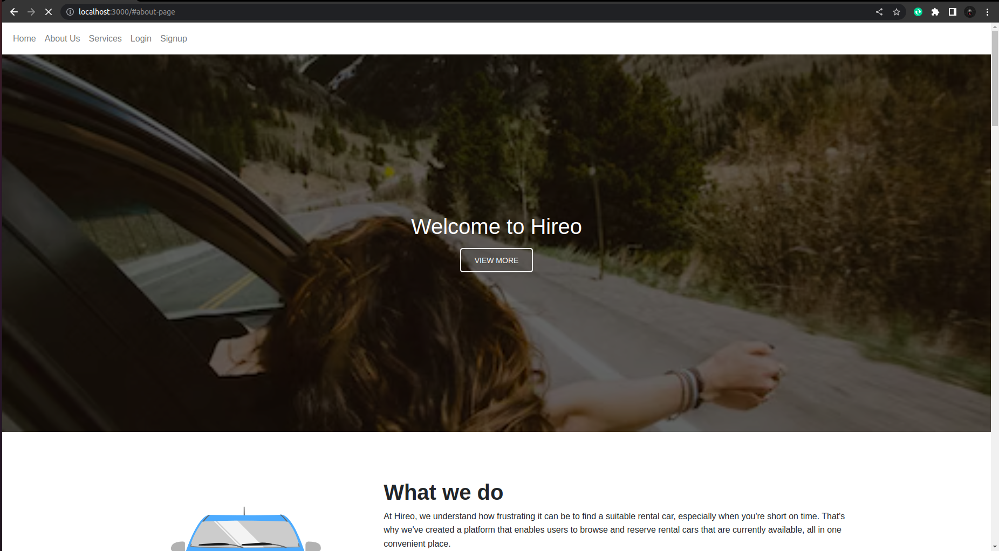

# Phase 3 Project

## Hireo: Client Front end

- A platform that enables users to browse and reserve rental cars that are currently available, all in one convenient place.

* The following image demonstrates the application functionality:


## Tech stack
- Ruby.
- HTML & CSS.
- React.
- React Router DOM.

## Instructions

run:
```
    npx create-react-app my-app-frontend
```

On localhost, run 
```
    npm start
```

## GitHub Backend link:
[Click me](https://github.com/SusanGithaigaN/phase-3-sinatra-react-project)

[Server link](https://web-production-0a58.up.railway.app/)

